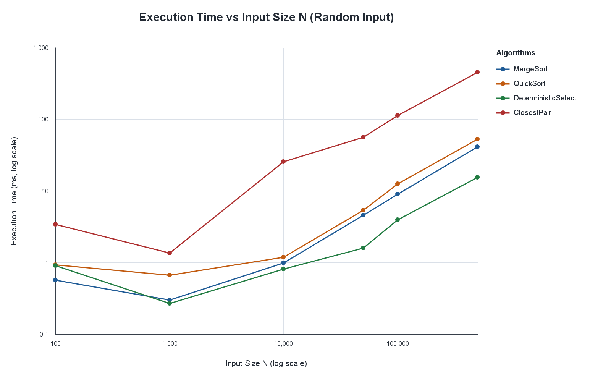
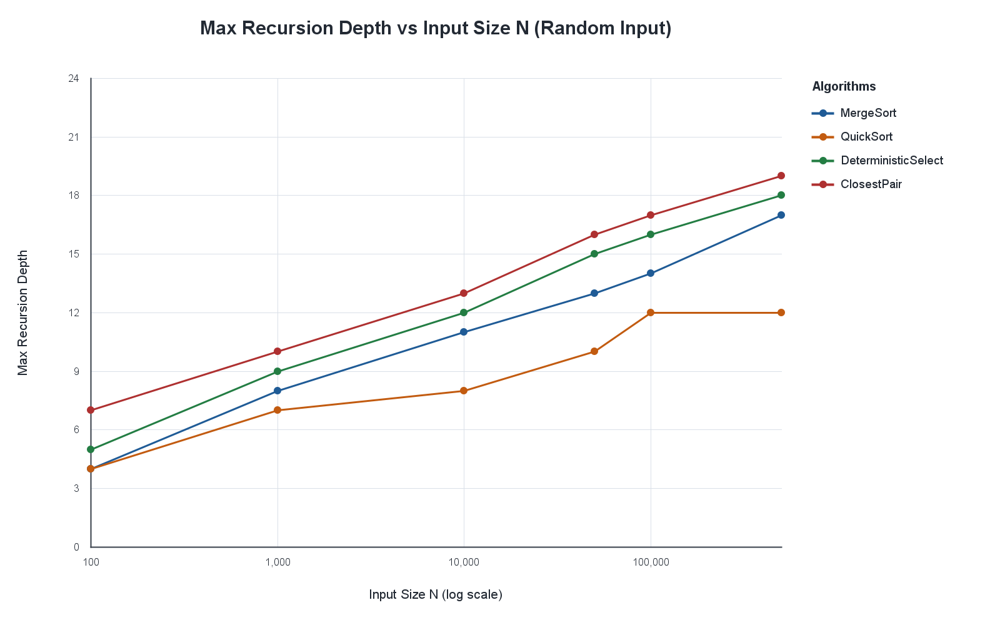
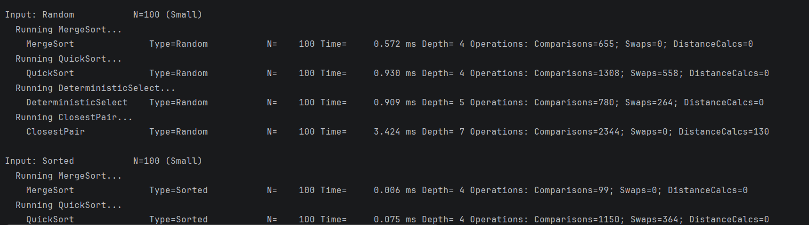
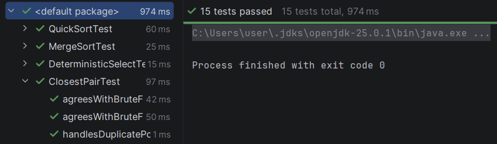

# Divide-and-Conquer Algorithms

## Excel visualizations

The benchmark data is in `results/results.csv`. The CSV uses `Random` for the random input type (rather than `RANDOM`); Excel's text filter is case-insensitive.

1. Open Excel and choose **Data → From Text/CSV**. Select `results/results.csv`, confirm comma-delimited parsing and the headers, then load the data as a table.
2. Use the `InputType` header filter and select only **Random**. The remaining rows contain six input sizes for each of the four algorithms.
3. To make a compact chart data range, create a new worksheet with columns `InputSize`, `MergeSort`, `QuickSort`, `DeterministicSelect`, and `ClosestPair`. List each input size once in ascending order. For each size, copy the value from the matching algorithm row in the filtered table. Use `ExecutionTimeMs` for the first chart and `MaxRecursionDepth` for the second.
4. Select the helper table and choose **Insert → Scatter (X, Y) → Scatter with Markers**. Set each algorithm as a separate series, using `InputSize` as its X values and the metric column as its Y values. Add axis titles: **Input Size (N)** and **Execution Time (ms)**, or **Max Recursion Depth**.
5. Right-click the horizontal axis, choose **Format Axis**, and enable **Logarithmic scale**. Repeat for the vertical axis. All plotted values are positive, as required for logarithmic axes.
6. Select the chart and use **Chart Design → Add Chart Element** to give it a descriptive title and legend. Right-click the chart, choose **Save as Picture**, select PNG, and save the files as `plots/time_vs_n.png` and `plots/recursion_depth_vs_n.png`. Create the `plots` directory first if needed.

The project CSV also includes sorted, reverse-sorted, and duplicate-heavy runs. Keep the `InputType` filter set to **Random** when preparing these two charts so they represent the same input distribution.

## A. Project overview

This Java 17 project implements four divide-and-conquer algorithms in separate classes:

- **MergeSort** divides the input into halves, sorts them, and merges them using one reusable auxiliary array. A cutoff of 15 elements uses insertion sort for small ranges.
- **Randomized QuickSort** uses an in-place three-way partition around a randomly selected pivot. It recursively sorts only the smaller partition and iterates over the larger one to bound call-stack usage.
- **Deterministic Select** finds a zero-based k-th order statistic using groups of five, their medians, and a median-of-medians pivot. It partitions in place and continues only in the partition containing the target.
- **Closest Pair** finds the nearest two points in the plane by sorting on coordinates, solving the two halves, then checking the Y-ordered strip. A brute-force implementation is included as a correctness reference.

`Experiment` benchmarks six sizes (100, 1,000, 10,000, 50,000, 100,000, and 500,000) and four input types. It reports execution time, recursion depth, and algorithm-specific operation counts to the console and writes the rows to `results/results.csv`.

### Build, test, and run

With Java 17 and Maven installed:

```text
mvn test
```

To run the benchmark from the project root:

```text
javac -d out src\*.java
java -cp out Main
```

The default output is `results/results.csv`. `Experiment` creates the output directory automatically.

## B. Recurrences and asymptotic analysis

### MergeSort

For `n` elements, two subproblems of size approximately `n/2` are sorted, then merged in linear time:

```text
T(n) = 2T(n/2) + Θ(n)
```

Here `a = 2`, `b = 2`, and `n^(log_b(a)) = n`. The merge work is `Θ(n)`, so Master Theorem Case 2 gives:

```text
T(n) = Θ(n log n)
```

The insertion-sort cutoff changes only the constant work at small subproblem sizes, not the asymptotic bound.

### Randomized QuickSort

With a balanced partition in expectation, the expected recurrence is:

```text
E[T(n)] = 2E[T(n/2)] + Θ(n)
```

The partition costs `Θ(n)`, and Master Theorem Case 2 gives expected `Θ(n log n)` time. A randomized pivot does not eliminate the `Θ(n²)` worst case; it makes persistently poor partitions unlikely. The smaller-partition recursion strategy bounds stack space independently of pivot quality.

### Deterministic Select (Median-of-Medians)

Grouping into fives and selecting the median of the group medians takes linear work to form and partition around the pivot. The pivot guarantees that the larger remaining selection subproblem has size at most about `7n/10`:

```text
T(n) ≤ T(n/5) + T(7n/10) + O(n)
```

The recursive fractions sum to `1/5 + 7/10 = 9/10 < 1`; the linear partition/grouping work absorbs the resulting geometric recursion. Therefore the worst-case running time is `O(n)` (also `Θ(n)` because selection must inspect the input in the worst case).

### Closest Pair of Points

After the points are sorted, each level divides the points into two halves, solves both halves, and scans the Y-ordered strip in linear time:

```text
T(n) = 2T(n/2) + O(n)
```

Master Theorem Case 2 yields `Θ(n log n)` total time, including the initial sorting. The brute-force reference method takes `Θ(n²)` time.

## C. Experimental results

The table below is a representative sample of the `Random` rows in the checked-in CSV. Timings are from a single run and are machine/JVM dependent; the operation counts and recursion depths help interpret them alongside elapsed time.

| N | Algorithm | Time (ms) | Max depth | Operations |
|---:|---|---:|---:|---|
| 100 | MergeSort | 1.3768 | 4 | 655 comparisons |
| 100 | QuickSort | 1.0993 | 4 | 1,071 comparisons; 444 swaps |
| 100 | DeterministicSelect | 0.6749 | 5 | 780 comparisons; 264 swaps |
| 100 | ClosestPair | 5.4930 | 7 | 2,344 comparisons; 130 distance calculations |
| 10,000 | MergeSort | 1.4391 | 11 | 127,816 comparisons |
| 10,000 | QuickSort | 1.7526 | 8 | 243,024 comparisons; 112,047 swaps |
| 10,000 | DeterministicSelect | 1.2324 | 12 | 99,193 comparisons; 35,380 swaps |
| 10,000 | ClosestPair | 33.5601 | 13 | 493,208 comparisons; 12,335 distance calculations |
| 500,000 | MergeSort | 40.6693 | 17 | 9,486,886 comparisons |
| 500,000 | QuickSort | 50.4732 | 13 | 18,880,347 comparisons; 8,947,076 swaps |
| 500,000 | DeterministicSelect | 13.1914 | 18 | 5,184,872 comparisons; 1,856,099 swaps |
| 500,000 | ClosestPair | 450.1901 | 19 | 33,082,232 comparisons; 556,159 distance calculations |

The timings above are representative measurements, not averaged benchmark statistics. The experiment constructs closest-pair points as `(i, input[i])`, so their X coordinates are ordered by construction; this is not a uniformly random 2D point cloud.





Create these chart images from the random-input rows using the Excel steps above and save them at the referenced paths.

## D. Discussion

1. **Do empirical results match theoretical complexity?** Broadly, larger inputs require more work, and the measured operation counts for MergeSort and ClosestPair grow consistently with `n log n`; selection work grows approximately linearly. Timings do not show a perfectly smooth curve: these are single-run measurements, small inputs are dominated by fixed overhead, and JVM/runtime effects can obscure asymptotic trends.
2. **How do input variations affect performance?** MergeSort remains `Θ(n log n)`, though already sorted input benefits from the merge-boundary check and reverse input changes comparison counts. Randomized QuickSort's pivot handling and three-way partition make duplicate-heavy inputs especially efficient; sorted and reverse-sorted inputs are not intrinsically bad cases for a randomized pivot. Selection's pivot quality and number of equal keys affect partition sizes. Closest Pair depends on point geometry as well as N; here input values become Y coordinates while X is the original index.
3. **How does QuickSort remain stack-safe?** After partitioning, it makes a recursive call only for the smaller side and continues the larger side by updating loop bounds. Each nested call therefore operates on at most half of its caller's range, bounding maximum recursive depth by `O(log n)` even if total running time degrades.
4. **Why does the 3n/10 bound hold for Deterministic Select?** At least half of the group medians are at or above the median-of-medians pivot, and each complete group contributes at least three elements at or above that group's median (and hence at or above the pivot). Symmetrically, at least about `3n/10` elements are at or below the pivot. Rounding and the one incomplete group change this by only a constant, so the larger side is at most `7n/10 + O(1)`. This gives the stated linear recurrence with recursive fractions whose sum is less than one.
5. **Why is the Closest-Pair strip check bounded?** Let `δ` be the smaller of the best distances in the left and right halves. A cross-half closest pair must lie within `δ` of the dividing line. When points are visited in Y order, packing the strip into `δ/2`-sized cells shows that only a constant number of subsequent points can be within vertical distance `δ` of any point. Thus the strip scan contributes `O(n)` work at a recursion level, rather than comparing every pair in the strip.
6. **How do JVM and hardware effects influence results?** Just-in-time compilation can make later operations faster than early ones; garbage collection and allocation add variable pauses; caches and memory bandwidth affect array-heavy work. The experiment is not a warmed-up, repeated microbenchmark, so compare broad trends and counts rather than treating small timing differences as conclusive.

## E. Reflection: hardware-aware algorithm design

Asymptotic analysis describes growth, but implementation details determine constants and resource behavior on real machines. MergeSort's reusable buffer avoids per-recursion allocation, while its insertion-sort cutoff reduces overhead on small ranges. QuickSort's in-place partitioning saves auxiliary memory, and its smaller-side recursion explicitly controls stack use. Deterministic Select trades more involved pivot work for a worst-case linear guarantee. Closest Pair's coordinate ordering and strip scan make good use of sequential array access, while point distribution affects the constant work in the strip. Reliable performance analysis should pair complexity arguments with repeatable, warmed-up measurements and report the hardware and JVM configuration.

## F. Screenshots

Add the requested screenshots at these paths:

- Program output: `screenshots/output.png`
- Test results: `screenshots/test_results.png`






---

## Declaration
> I agree that all files which I uploaded might be submitted to the StrikePlagiarism.com antiplagiarism system in order to check originality of the text.